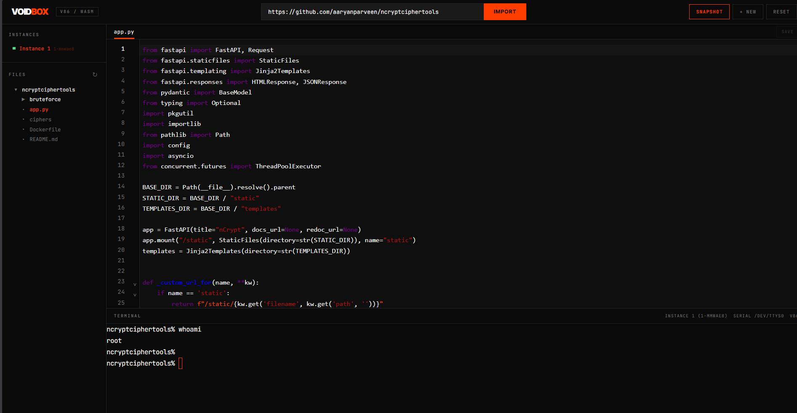
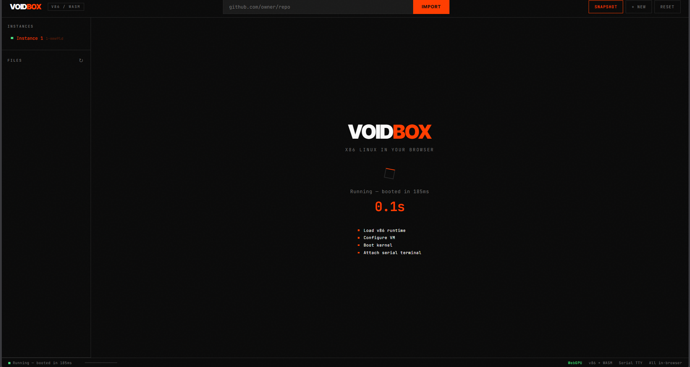
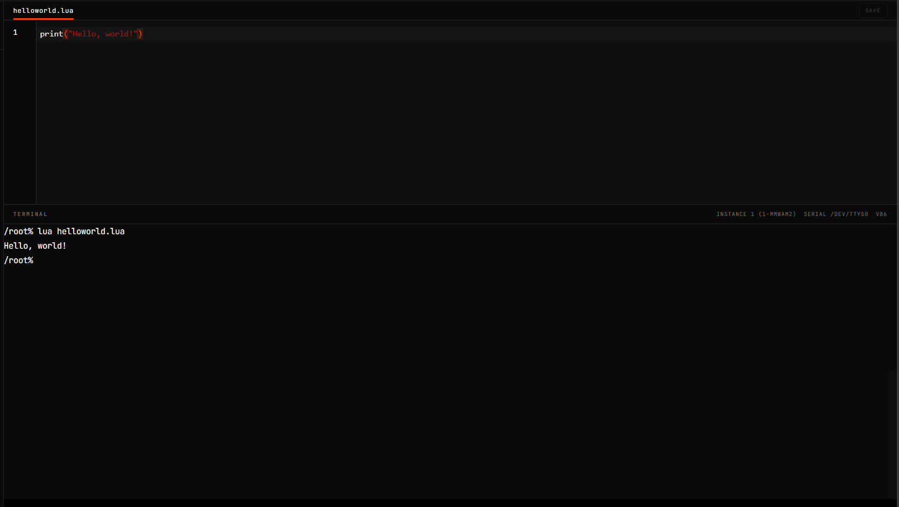
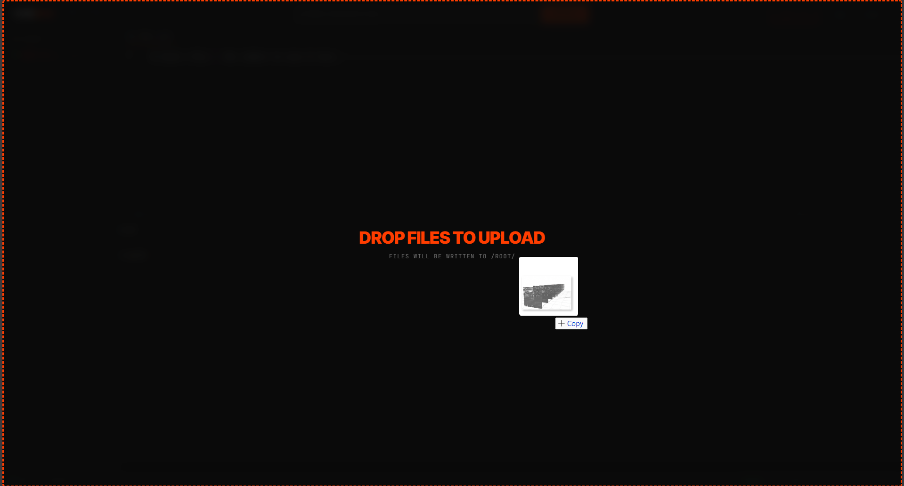

# VOIDBOX

VOIDBOX is a (currently) Linux VM that runs entirely in your browser. There's no backend, no server, no sign-up. On opening, Linux environment boots up in a few seconds in the browser memory itself using WASM, and you get a terminal, a code editor, a file browser, and the ability to pull in GitHub repos (soon), all in one tab. Everything stays in your browser. When you close the tab, it's gone, unless you snapshot it.
Based on Google V8 Just in time compiler and v86.



---

## Running it

Clone the repo, install dependencies, start the dev server.

```
git clone https://github.com/aaryanparveen/voidbox.git
cd voidbox
npm install
npm run dev
```

The VM boots in a few seconds. For a production build, `npm run build` gives you static files you can throw on any hosting.

---

## How the VM works

Under the hood this uses v86, which is an x86 emulator compiled to WebAssembly. It runs a real Linux kernel. The screen is completely disabled, everything goes through a serial console, which is how the terminal and all the automation talk to the VM.

When you load the page, the app creates a v86 instance configured with a bzImage, BIOS files, and a network relay (soon). The lifecycle manager tracks the VM through idle, booting, and running states, and handles things like capping how many VMs you can have at once and killing idle ones after a timeout.

Once the VM is up, the app auto-logs in.



---

## The terminal

The terminal is xterm.js wired to the VM's serial port. There's a WebGL renderer that kicks in when the browser supports it.

The interesting part is what happens underneath. The terminal bridge has a command capture mode where the app can programmatically run commands inside the VM and get the output back. It wraps each command in sentinel markers, waits for the markers to appear in the output, and extracts everything in between. It queues these up and only runs them when you're not actively typing, so it doesn't interfere with whatever you're doing.

This is how basically everything works: reading files, writing files, checking if a path exists, listing directories, running setup scripts after an import. It all goes through this serial command queue. It sounds fragile (and it is) but it works.



---

## Editing files

The code editor is CodeMirror. It detects the language from the file extension and switches highlighting automatically, JavaScript, TypeScript, Python, HTML, CSS, JSON. Mod+S saves, and there's an auto-save that fires after you stop typing for a bit.

Writing files back to the VM is trickier than you'd think. You can't just echo arbitrary content through a shell because special characters will break everything. Instead, the app encodes the file content as hex-escaped bytes and sends it as chunked printf commands over the serial bridge. It's ugly but it handles any file content without choking on quotes, backslashes, or newlines.

The file explorer on the left works by running `find` inside the VM and parsing the output into a tree. You can expand folders, click files to open them in the editor, and right-click for things like rename and delete.

You can also drag and drop files from the host into the file system.



---

## GitHub import

There's an input field in the header where you paste a GitHub URL. Hit import and it pulls the repo contents through the GitHub API and writes every file into the VM filesystem using the serial bridge.

After import, the app parses the README looking for shell code blocks that look like setup instructions. It uses some rough heuristics to figure out which sections are install or build steps and can extract those commands for you. (currently broken, mainly due to lack of internet access)

Keep in mind currently, too many requests from the same IP might get you rate-limited by the Github API.

---

## Snapshots and storage

You can save a full snapshot of the VM state, memory, CPU, everything, and restore it later. It all lives in IndexedDB in your browser. There's also session tracking, a cache for downloaded assets, and a place for user preferences.

The snapshots are the main thing. You can boot a VM, set it up how you like, snapshot it, and next time you open the page you're right back where you were instead of waiting for a fresh boot.

---

## Todo
Networking from the VM through the sandbox through WASI/JSPI/WASMEdge/whatever I'm able to get working.
OPFS Integration for a host folder to mount for larger projects.
